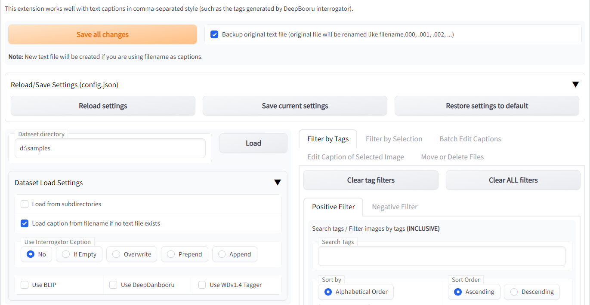
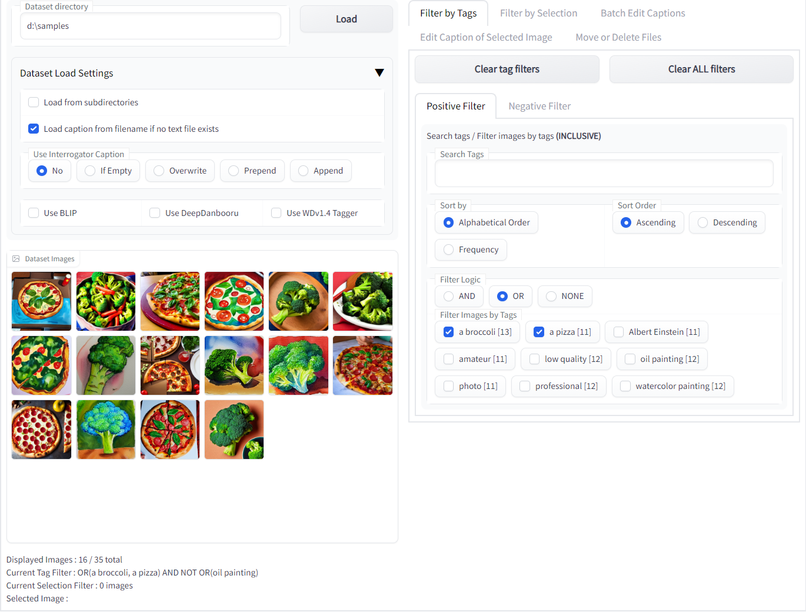
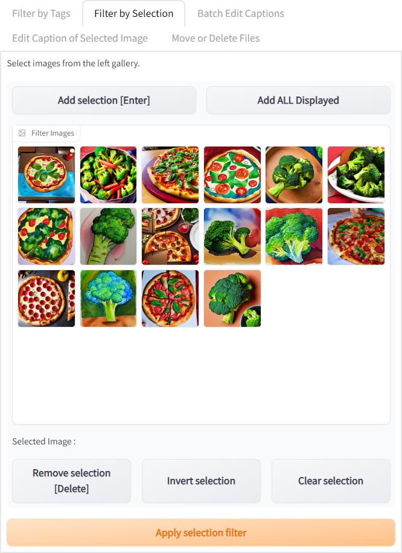
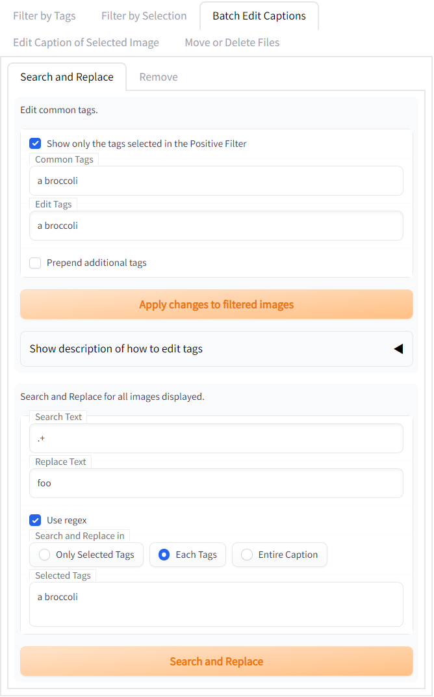
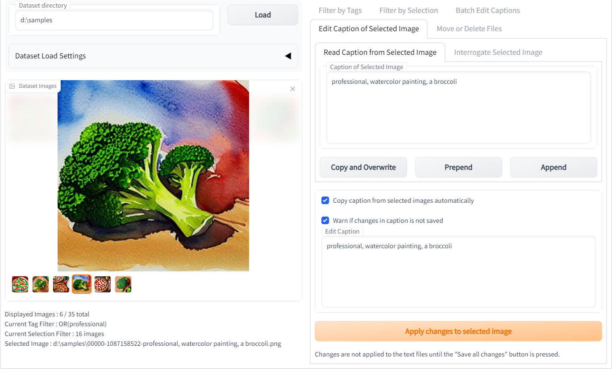
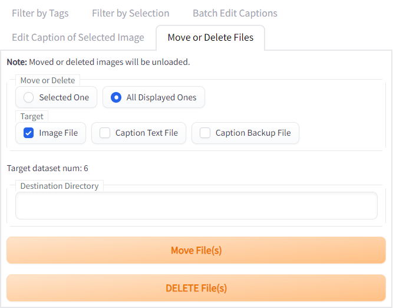

# 表示内容

## 共通

- "Save all changes" ボタン
  - キャプションをテキストファイルに保存します。このボタンを押すまで全ての変更は適用されません。
  - "Backup original text file" にチェックを入れることで、保存時にオリジナルのテキストファイル名をバックアップします。
    - バックアップファイル名は、filename.000、 -.001、 -.002、…、のように付けられます。
  - キャプションを含むテキストファイルが無い場合は新しく作成されます。
- "Reload/Save Settings" アコーディオン
  - UIで表示されている設定を全て再読み込み・保存したり、デフォルトに戻せます。
    - "Reload settings" : 設定を再読み込みします。
    - "Save current settings" : 現在の設定を保存します。
    - "Restore settings to default" : 設定をデフォルトに戻します（保存はしません）。
  - 設定は `.../tag-editor-root-dir/config.json` に保存されています。
- "Dataset Directory" テキストボックス
  - 学習データセットのあるディレクトリを入力してください。
  - 下のオプションからロード方法を変更できます。
    - "Load from subdirectories" をチェックすると、全てのサブディレクトリを含めて読み込みます。
    - "Load captioin from filename if no text file exists" をチェックすると、画像と同名のテキストファイルが無い場合に画像ファイル名からキャプションを読み込みます。
    - "Use Interrogator Caption" ラジオボタン
      - 読み込み時にBLIPやDeepDanbooruを使用するか、またその結果をキャプションにどう反映させるかを選びます。
        - "No": BLIPやDeepDanbooruを使用しません。
        - "If Empty": キャプションが無い場合のみ使用します。
        - "Overwrite" / "Prepend" / "Append": 生成したキャプションで上書き/先頭に追加/末尾に追加します。
- "Dataset Images" ギャラリー
  - 教師画像の確認と選択ができます。
  - 表示する列数はwebUIの "Settings" タブから変更できます。

***

## "Filter by Tags" タブ

## 共通
- "Clear tag filters" ボタン
  - タグの検索やタグによる画像の絞り込みを取り消します。
- "Clear ALL filters" ボタン
  - "Filter by Selection" タブでの画像選択による絞り込みを含めて、全ての絞り込みを取り消します。

## Search tags / Filter images by tags
"Positive Filter" : 指定した条件を**満たす**画像を表示します。  
"Negative Filter" : 指定した条件を**満たさない**画像を表示します。  
両フィルタは同時に指定可能です

- "Search Tags" テキストボックス
  - 入力した文字で下に表示されているタグを検索し絞り込みます。
- "Sort by / Sort order" ラジオボタン
  - 下に表示されているタグの並び順を切り替えます。
    - Alphabetical Order / Frequency : アルファベット順／出現頻度順
    - Ascending / Descending : 昇順／降順
- "Filter Logic" ラジオボタン
  - 絞り込みの方法を指定します。
    - "AND" : 選択したタグを全て含む画像
    - "OR" : 選択したタグのいずれかを含む画像
    - "NONE" : フィルタを無効にする
- "Filter Images by Tags" チェックボックス
  - 選択したタグによって左の画像を絞り込みます。絞り込まれた画像のキャプションの内容に応じて、タグも絞り込まれます。

***

## "Filter by Selection" タブ

- "Add selection" ボタン
  - 左で選択した画像を選択対象に追加します。
  - ショートカットは "Enter" キーです。
  - Tips: ギャラリーで選択している画像は矢印キーでも変更できます。
- "Remove selection" ボタン
  - "Filter Images" で選択している画像を選択対象から外します。
  - ショートカットは "Delete" キーです。
- "Invert selection" ボタン
  - 現在の選択対象を反転し、全データセットのうち選択されていないものに変更します。
- "Clear selection" ボタン
  - 全ての選択を解除します。既にある絞り込みは解除しません。
- "Apply selection filter" ボタン
  - 選択対象によって左の画像を絞り込みます。

***

## "Batch Edit Captions" タブ

## "Search and Replace" タブ
複数のタグを一括置換できます
- "Edit common tags" は、表示されている画像のタグを編集するシンプルな方法です。
  - "Common Tags" テキストボックス (編集不可)
    - 表示されている画像に共通するタグをカンマ区切りで表示します。
    - 上の "Show only … Positive Filter" をチェックすることで、"Filter by Tags" の "Positive Filter" で選択したもののみ表示することができます。
  - "Edit Tags" テキストボックス
    - 共通のタグを編集します。編集内容は絞り込まれている画像にのみ適用されます。表示されていないタグには影響しません。
      - 編集すると、カンマ区切りで同じ場所にあるタグを置換できます。
      - タグを空白に変えることで削除できます。
      - 末尾にタグを追加することでキャプションに新たなタグを追加できます。
        - タグが追加される位置はキャプションの先頭と末尾を選べます。
          - "Prepend additional tags" をチェックすると先頭、チェックを外すと末尾に追加します。
  - "Apply changes to filtered images" ボタン
    - 絞り込まれている画像に、タグの変更を適用します。
- "Search and Replace" では、表示されている画像のタグまたはキャプション全体に対して一括置換ができます。
  - "Use regex" にチェックを入れることで、正規表現が利用可能です。
  - "Search Text" テキストボックス
    - 置換対象の文字列を入力します。
  - "Replace Text" テキストボックス
    - この文字列で "Search Text" を置換します。
  - "Search and Replace in" ラジオボタン
    - 一括置換の範囲を選択します
      - "Only Selected Tags" : "Positive Filter" で選択したタグのみ、それぞれのタグを個別に置換
      - "Each Tags" : それぞれのタグを個別に置換
      - "Entire Caption" : キャプション全体を一度に置換
  - "Search and Replace" ボタン
    - 一括置換を実行します

## "Remove" タブ
複数のタグを簡単に一括削除できます
- "Remove duplicate tags" ボタン
  - キャプションの中に複数存在するタグを1つにする
- "Remove selected tags" ボタン
  - 下で選択したタグを削除する
  - "Search Tags" からタグの検索と絞り込みが可能
  - "Select visible tags" で表示されているタグ全てを選択、"Deselect visible tags" で選択解除する。

***

## "Edit Caption of Selected Image" タブ

## "Read Caption from Selected Image" タブ
- "Caption of Selected Image" テキストボックス
  - 左で選択した画像のキャプションを表示します。

## "Interrogate Selected Image" タブ
- "Interrogate Result" テキストボックス
  - 左で選択した画像にBLIPやDeepDanbooruを使用した結果を表示します。

## 共通
- "Copy and Overwrite / Prepend / Apppend" ボタン
  - 上のテキストボックスの内容を、下のテキストボックスに、コピーして上書き/先頭に追加/末尾に追加します。
- "Edit Caption" テキストボックス
  - ここでキャプションの編集が可能です。
- "Apply changes to selected image" ボタン
  - 選択している画像のキャプションを "Edit Tags" の内容に変更します。

## "Move or Delete Files" タブ

- "Move or Delete" ラジオボタン
  - 操作を実行する対象を選びます。
    - "Selected One" : 左のギャラリーで選択されている画像のみ
    - "All Displayed Ones" : 左のギャラリーで表示されている画像全て
- "Target" チェックボックス
  - 操作を実行する対象を選びます。
    - "Image File" : 画像ファイル
    - "Caption Text File" : キャプションファイル
    - "Caption Backup File" : キャプションファイルのバックアップ
- "Move File(s)" ボタン
  - "Destination Directory" で指定したディレクトリにファイルを移動します。
- "DELETE Files(s)" ボタン
  - ファイルを削除します。
  - 注意 : ごみ箱には送られず、完全に削除されます。