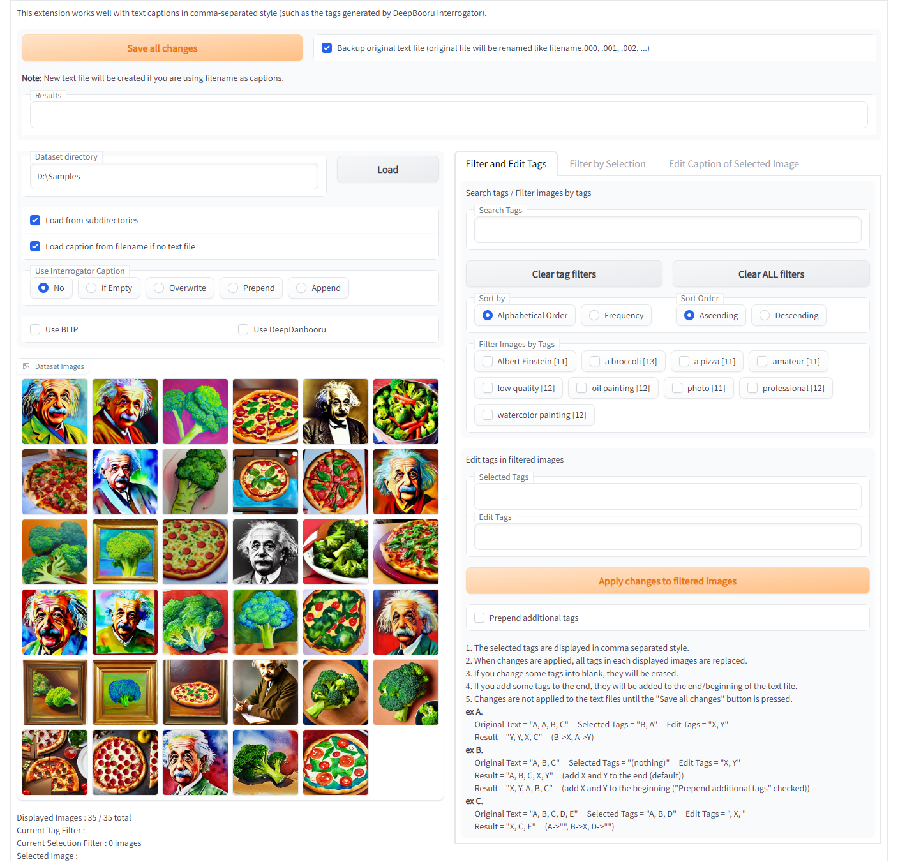
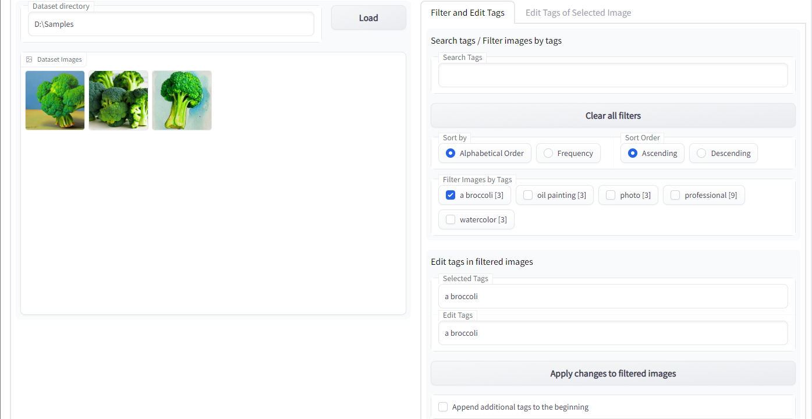
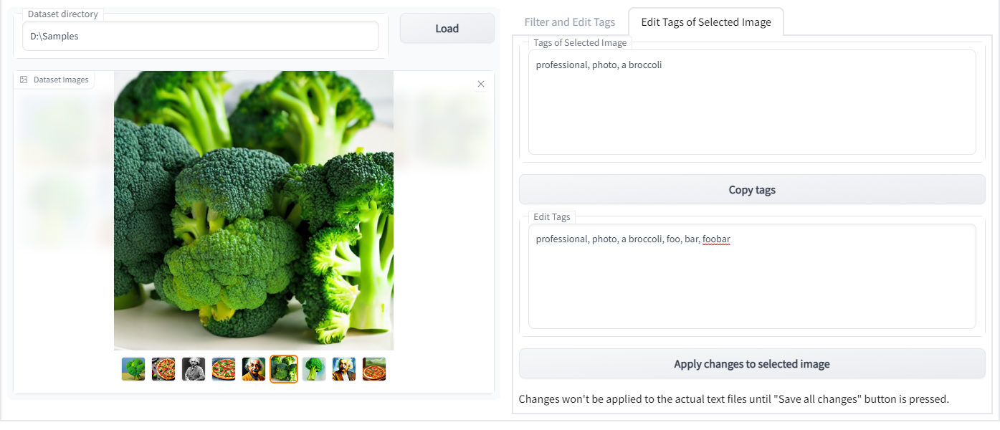

# Dataset Tag Editor

[日本語 Readme](README-JP.md)

This is an extension to edit captions in training dataset for [Stable Diffusion web UI by AUTOMATIC1111](https://github.com/AUTOMATIC1111/stable-diffusion-webui).



It works well with text captions in comma-separated style (such as the tags generated by DeepBooru interrogator).

Caption in the filenames of images can be loaded, but edited captions can only be saved in the form of text files.

## Installation
To install, clone the repository into the `extensions` directory and restart the web UI.

On the web UI directory, run the following command to install:
```commandline
git clone https://github.com/toshiaki1729/stable-diffusion-webui-dataset-tag-editor.git extensions/dataset-tag-editor
```

## Features
Note. "tag" means each blocks of caption separated by commas.
- Edit captions while viewing related images
- Search tags
- Filter images by tags and edit those captions
- Batch replace/remove/append tags


## Usage
1. Make dataset using web UI
2. Load them
3. Select tags you want to edit in "Filter and Edit Tags" tab
4. Replace / remove them or append new tags to captions
5. Use "Edit Caption of Selected Image" tab if you want to edit the caption individually
6. Click "Save all changes" button


## Description of Display

### Common
- "Save all changes" buttton
  - save captions to text file
    - changes are not be applied to the text files until you press the button
  - if "Backup original text file" is checked, original text files will be renamed not to be overwritten
    - backup file name will be like filename.000, -.001, -.002, ...
  - new text file will be created if you are using filename as caption
- "Results" text box
  - shows save results
- "Dataset Directory" text box
  - input the directory of training images
- "Dataset Images" gallery
  - to view and select images


### "Filter and Edit Tags" tab


- "Search Tags" text box
  - search and filter the tags displayed below
- "Clear all filters" button
  - clear filters by tag search and image filter
- "Sort by / Sort order" radio buttons
  - change sort order of the tags displayed below
- "Filter Images by Tags" checkboxes
  - filter images displayed in the left gallery by tags
    - also filter tags depending on captions of the displayed images
- "Selected Tags" text box (not editable)
  - shows the selected tags in comma separated style
- "Edit Tags" text box
  - you can edit the selected tags for all captions of the displayed images
    - each tags will be replaced by the tags in "same place"
    - erase tags by changing it into blank
    - you can append some tags to captions by add new tags at the end
      - the tags will be appended at the beggining/end of text files depending on the checkbox below
- "Apply changes to filtered images" button
  - apply the tag changes only to displayed images


### "Edit Caption of Selected Image" tab


- "Caption of Selected Image" textbox
  - shows the caption of the selected image in the left gallery
- "Copy caption" button
  - copy the caption above to the textbox below
- "Edit Caption" textbox
  - edit caption here
- "Apply changes to selected image" button
  - change the caption of selected image into the text in "Edit Tags" textbox