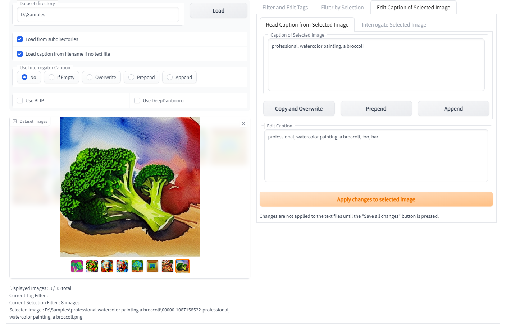
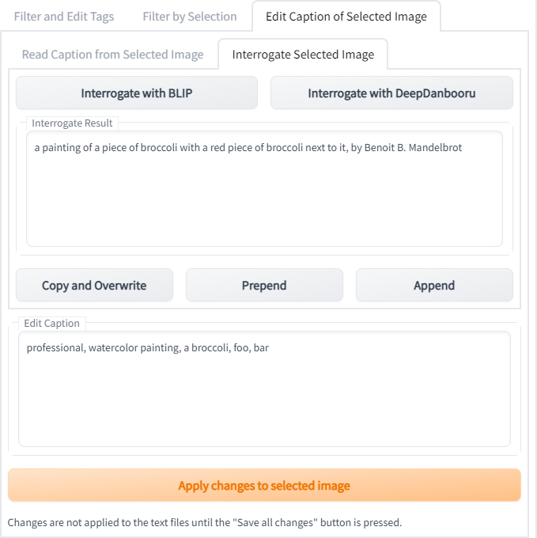

# Dataset Tag Editor

[日本語 Readme](README-JP.md)

This is an extension to edit captions in training dataset for [Stable Diffusion web UI by AUTOMATIC1111](https://github.com/AUTOMATIC1111/stable-diffusion-webui).


It works well with text captions in comma-separated style (such as the tags generated by DeepBooru interrogator).

Caption in the filenames of images can be loaded, but edited captions can only be saved in the form of text files.

## Installation
### Extensions tab on WebUI
Copy `https://github.com/toshiaki1729/stable-diffusion-webui-dataset-tag-editor.git` into "Install from URL" tab.

Also, if you see this extension listed, you can install from "Available" tab with a single click.

### Install Manually
To install, clone the repository into the `extensions` directory and restart the web UI.

On the web UI directory, run the following command to install:
```commandline
git clone https://github.com/toshiaki1729/stable-diffusion-webui-dataset-tag-editor.git extensions/dataset-tag-editor
```

## Features
Note. "tag" means each blocks of caption separated by commas.
- Edit captions while viewing related images
- Search tags
- Filter images by tags and edit those captions
- Batch replace/remove/append tags
- Use interrogators


## Usage
1. Make dataset using web UI
1. Load them
    - use interrogator if needed
1. Edit their captions
    - filter images you want to edit by tags in "Filter and Edit Tags" tab
      - search tags and filter images by tags
      - replace / remove them or append new tags to their captions
    - filter images manually in "Filter by Selection" tab
    - edit captions individually in "Edit Caption of Selected Image" tab
      - you also can use interrogator here
1. Click "Save all changes" button


## Description of Display

### Common
- "Save all changes" buttton
  - save captions to text file
    - changes will not be applied to the text files until you press the button
  - if "Backup original text file" is checked, original text files will be renamed not to be overwritten
    - backup file name will be like filename.000, -.001, -.002, ...
  - new text file will be created if you are using filename as caption
- "Results" text box
  - shows save results
- "Dataset Directory" text box
  - input the directory of training images and load them by clicking "Load" button
  - loading options are below
  - you can make caption on loading by using interrogator if needed
- "Dataset Images" gallery
  - to view and select images
  - the number of colums can be changed in "Settings" tab

***

### "Filter and Edit Tags" tab


- "Search Tags" text box
  - search and filter the tags displayed below
- "Clear tag filters" button
  - clear tag search and filter by tags
- "Clear ALL filters" button
  - clear all filters including selection filter in next tab
- "Sort by / Sort order" radio buttons
  - change sort order of the tags displayed below
- "Filter Images by Tags" checkboxes
  - filter images displayed in the left gallery by tags
    - also filter tags depending on captions of the displayed images
- "Selected Tags" text box (not editable)
  - shows the selected tags in comma separated style
- "Edit Tags" text box
  - you can edit the selected tags for all captions of the displayed images
    - each tags will be replaced by the tags in "same place"
    - erase tags by changing it into blank
    - you can append some tags to captions by add new tags at the end
      - the tags will be added to the beggining/end of text files depending on the checkbox below
- "Apply changes to filtered images" button
  - apply the tag changes only to displayed images

***

### "Filter by Selection" tab


- "Add selection" button
  - to include selected dataset image in selection
  - "Enter" is shortcut key
  - Tips: you can change the selected image in gallery using arrow keys
- "Remove selection" button
  - to remove selected image from selection
  - "Delete" is shortcut key
- "Invert selection" button
  - select all images in the entire dataset that have not been selected
- "Clear selection" button
  - to remove all current selection, not to clear current filter
- "Apply selection filter" button
  - apply selection filter on displaying dataset images

***

### "Edit Caption of Selected Image" tab
 

#### "Read Caption from Selected Image" tab
- "Caption of Selected Image" textbox
  - shows the caption of the selected image in the dataset gallery

#### "Interrogate Selected Image" tab
- "Interrogate Result" textbox
  - shows the result of interrogator

#### Common
- "Copy and Overwrite / Prepend / Apppend" button
  - copy/prepend/append the content in the textbox above to the textbox below
- "Edit Caption" textbox
  - edit caption here
- "Apply changes to selected image" button
  - change the caption of selected image into the text in "Edit Tags" textbox